# 🔄 Fluxo do Agente — Arquitetura HIVE OS v4.0

> **Antigravity Kit** - Sovereign Agent Workflow Documentation
> **Edition**: Sovereign v4.0 (HIVE OS)
> **Philosophy**: Built on "Truth in Data" and "Domain Sovereignty"

---

## 📊 Visual Core — HIVE OS Flow

### 1. Blueprint de Alto Nível (ASCII)

```text
┌─────────────────────────────────────────────────────────────────┐
│                         USER REQUEST                             │
└────────────────────────────┬────────────────────────────────────┘
                             │
                             ▼ [Engine Ignition]
┌─────────────────────────────────────────────────────────────────┐
│                  INTERNAL BOOT SEQUENCE (v4.0)                   │
│  1. Atlas Soberano      → (Strategic Vision)                    │
│  2. CODEBASE.md         → (Technical Reality)                   │
│  3. .agent/ARCHITECTURE → (Resource Mapping)                    │
└────────────────────────────┬────────────────────────────────────┘
                             │
                             ▼
┌─────────────────────────────────────────────────────────────────┐
│                    REQUEST CLASSIFICATION                        │
│  • Detect Agent Mastery (Orchestrator, Frontend, Backend, etc.) │
│  • Inject Satellites (@mentions for Docker, Wpp, Supabase)      │
└────────────────────────────┬────────────────────────────────────┘
                             │
                             ▼
┌─────────────────────────────────────────────────────────────────┐
│                    SOCRATIC GATE V2 (P0)                         │
│  1. Premise?  2. Difference?  3. Simplicity?  4. Worst Case?    │
└────────────────────────────┬────────────────────────────────────┘
                             │
                             ▼
┌─────────────────────────────────────────────────────────────────┐
│                       TASK EXECUTION                            │
│  • Sequential Multi-Domain Implementation                       │
│  • Real-time Context Switching between Specialist Personas      │
└────────────────────────────┬────────────────────────────────────┘
                             │
                             ▼
┌─────────────────────────────────────────────────────────────────┐
│                  TRUTH IN DATA GATE (Zero Mock)                  │
│  • Audit: No fake data, no placeholders, no alucinations        │
└────────────────────────────┬────────────────────────────────────┘
                             │
                             ▼
┌─────────────────────────────────────────────────────────────────┐
│                      VERIFICATION PIPELINE                       │
│  • Quick Check: Security, Purity, Quality                       │
│  • Full Audit: E2E Integration, Lighthouse, Resonance           │
└────────────────────────────┬────────────────────────────────────┘
                             │
                             ▼
┌─────────────────────────────────────────────────────────────────┐
│                       ENTREGA DE RESULTADO                       │
└─────────────────────────────────────────────────────────────────┘
```

### 2. Deep Intelligence Flow (Mermaid)

```mermaid
graph TD
    subgraph "Engine Ignition Phase"
        A[USER REQUEST] --> B[BOOT SEQUENCE]
        B --> B1[Atlas Soberano]
        B --> B2[CODEBASE.md]
        B --> B3[ARCHITECTURE.md]
    end

    subgraph "Intent & Expertise Layer"
        B1 & B2 & B3 --> C[CLASSIFIER]
        C --> D{Master Routing}
        D -- "/slash" --> E[Native Workflows]
        D -- "@mention" --> F[Satellite Skill Injection]
        D -- "Natural" --> G[Agent Selection]
    end

    subgraph "Sovereign Execution"
        E & F & G --> H[SOCRATIC GATE V2]
        H -- "Approval" --> I[IMPLEMENTATION PLAN]
        I --> J[TASK EXECUTION]
    end

    subgraph "Integrity & Delivery"
        J --> K[TRUTH IN DATA GATE]
        K --> L[VERIFICATION PIPELINE]
        L --> M[FINAL DELIVERY]
    end

    style B fill:#003366,stroke:#fff,stroke-width:2px
    style H fill:#990000,stroke:#fff,stroke-width:2px
    style K fill:#daa520,stroke:#fff,stroke-width:2px
```



### 3. Step-by-Step Visual Guide

| Estágio      | Ícone | Ação Crítica                      | Documento de Controle           |
| :----------- | :---: | :-------------------------------- | :------------------------------ |
| **Ignição**  |  🔥   | Carregamento da Boot Sequence v4.0| `.gemini/GEMINI.md`             |
| **Contexto**  |  🧠   | Verificação de Atlas e CODEBASE   | `Atlas.md` / `CODEBASE.md`      |
| **Desafio**   |  🛡️   | Validação no Socratic Gate (4Q)   | `.agent/implementation_plan.md` |
| **Ação**      |  ⚙️   | Execução com Satélites (@mentions) | `.agent/skills/*.md`            |
| **Auditoria** |  ⚖️   | Truth in Data Gate (Zero Mock)    | `task.md`                       |
| **Entrega**   |  🚀   | Entrega do Valor ao Usuário       | `walkthrough.md`                |

---

## 🎯 Workflow Soberano Detalhado

### 1️⃣ **Protocolo de Ignição (Boot Sequence)**

Antes de qualquer processamento, o cérebro do agente sincroniza com a infraestrutura local:

1. **Atlas Soberano**: Lê decisões arquiteturais e IPs estratégicos (Supabase, Evolution).
2. **CODEBASE.md**: Mapeia a stack atual e evita sugerir tecnologias deprecadas.
3. **.agent/ARCHITECTURE.md**: Identifica satélites e scripts de validação disponíveis.

### 2️⃣ **Socratic Gate v2 (Obrigatório)**

Para sistemas complexos (>2 arquivos ou integrações), o agente deve validar internamente:

1. **Premissa**: Qual premissa central estou assumindo?
2. **Diferença**: Onde o problema pode ser diferente do que parece?
3. **Simplicidade**: Existe uma solução mais simples que estou ignorando?
4. **Pior Cenário**: Qual o pior cenário de falha desta abordagem?

> [!IMPORTANT]
> Se houver incerteza crítica em qualquer ponto, o agente deve fazer **UMA** pergunta ao usuário antes de prosseguir.

### 3️⃣ **Satellite Injection (@mentions)**

A expertise é injetada sob demanda via satélites MD em `.agent/skills/`:

- **@docker-skill**: Carrega patterns de rede e deploy VPS.
- **@evolution-skill**: Carrega protocolos de WhatsApp e diagnóstico.
- **@prompt-skill**: Carrega o framework de 5 camadas para LLMs.
- **@supabase-skill**: Carrega o schema "Beleza" e regras de RLS.

### 4️⃣ **Truth in Data Gate (P0)**

Uma camada de auditoria que proíbe:

- Dados **mock/fake** em ambiente de produção ou demonstração final.
- **Placeholders** visuais que alucinam progresso inexistente.
- Promessas de estado que não estão persistidas no banco real.

---

## 🛠 NATIVE WORKFLOWS (HIVE OS)

| Comando   | Agente Master       | Foco Principal                        |
| :------- | :------------------ | :------------------------------------ |
| `/create` | `orchestrator`      | Blueprint + Geração de Sistemas       |
| `/debug`  | `debugger`          | Diagnóstico de Root Cause             |
| `/review` | `security-auditor`  | Revisão de Qualidade e Segurança      |
| `/refactor`| `backend-specialist`| Reestruturação de Código              |
| `/audit`  | `orchestrator`      | Auditoria de Integridade e Dados      |
| `100x`    | `Tribunal`          | Arsenal Soberano (3+1 Passagens)      |

---

## 🔱 Protocolo de Revisão 100x (O Olhar do Orquestrador)

Quando o gatilho `100x` é detectado, o sistema suspende a resposta imediata e inicia o ciclo de **Revisão Soberana**:

1. **Passagem 1**: Resposta estatística/óbvia (Rascunho).
2. **Passagem 2**: Auditoria Socrática (Checklist P0 + Gaps).
3. **Passagem 3**: Perspectiva Adversarial (Cross-Domain Challenge).
4. **Passagem 4**: Amplificação Colaborativa (Visão dos 100 Especialistas).
5. **Passagem 5**: Convergência Soberana (Síntese + @skills).

> [!TIP]
> O **Amplificador 100x** permite ver a matriz de raciocínio coletivo antes da decisão final.

---

## 🧩 Validation Pipeline

### Quick Check (Soberano)

- **Security**: Scan de vulnerabilidades e exposição de chaves.
- **Purity**: Verificação de mocks/placeholders (Truth in Data).
- **Quality**: Lint, Types e Code Smells.

### Full Verification

- **E2E Integration**: Teste real via MCP (Evolution API / Supabase).
- **Lighthouse Audit**: Performance e Web Vitals.
- **Sovereign Resonance**: Feedback da saúde do sistema.

---

**Last Updated**: 2026-02-23
**Kernel Version**: 2.0.0 (HIVE OS v4.0)
